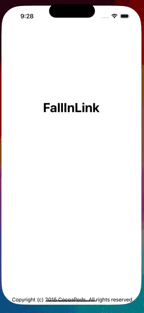

# FallInLink

[](https://travis-ci.org/Jeonhui/FallInLink)
[](https://cocoapods.org/pods/FallInLink)
[](https://cocoapods.org/pods/FallInLink)
[](https://cocoapods.org/pods/FallInLink)


> FallInLink is awesome link preview component. 
> we support free customization and url change during runtime.

we support [AndroidOS](https://github.com/fall-semester/fallinlink-Android) as well as iOS. 

## Requirements


## Example

To run the example project, clone the repo, and run `pod install` from the Example directory first. 

| FallInLink                  |
|-----------------------------|
|  |


## Installation

FallInLink is available through [CocoaPods](https://cocoapods.org). To install
it, simply add the following line to your Podfile:

```ruby
pod 'FallInLink'
```

## Swift Package Manager
- File > Swift Packages > Add Package Dependency
- Add https://github.com/fall-semester/fallinlink-iOS
```asm
https://github.com/fall-semester/fallinlink-iOS
```

## Author

Jeonhui, dlwjsgml02@naver.com

## License

FallInLink is available under the MIT license. See the LICENSE file for more info.
